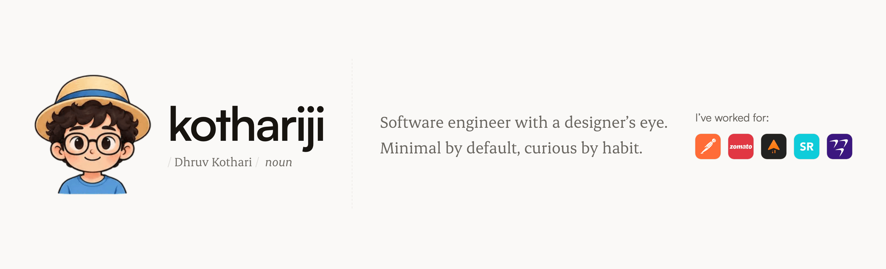

I'm a senior software engineer with 3+ years of experience crafting robust, scalable web experiences across frontend and full-stack roles. My core expertise lies in React, TypeScript, Node.js, Django, and building high-performance, accessible UIs. I've led the architecture of complex systems like analytics dashboards, onboarding flows, design systems, and AI-driven support interfaces.

I’m passionate about user experience, design thinking, and performance-first development. I enjoy pushing pixels in Figma, building stunning landing pages, and developing reusable component libraries. I’ve also worked on mobile apps using React Native and published open-source tools to streamline development.

Outside of product engineering, I’ve contributed as a tech speaker and technical writer, covering topics in web engineering, competitive programming, and developer growth. From mentoring engineers to winning inter-college coding competitions, I love building and learning in public. Let’s connect and build delightful digital experiences together!

### A few things I made

- **[SyntaxMeets](https://github.com/kothariji/SyntaxMeets)** · Create a room, call your friends, and write the algorithm together.
- **[competitive-programming](https://github.com/kothariji/competitive-programming)** · Everything I solved on the way in, kept public since 2020.
- **[use-media-stream](https://github.com/kothariji/use-media-stream)** · A React hook for getUserMedia that cleans up after itself.
- **[BhimIntegers](https://github.com/kothariji/BhimIntegers)** · A C++ library for integers that outgrow `long long`.

### Elsewhere

[kothariji.in](https://kothariji.in) ·
[Writings](https://kothariji.in/writings) ·
[Talks](https://kothariji.in/talks) ·
[LinkedIn](https://www.linkedin.com/in/kotharidhruv/) ·
[X](https://x.com/_kothariji) ·
[Topmate](https://topmate.io/kothariji) ·
[hello@kothariji.in](mailto:hello@kothariji.in)
